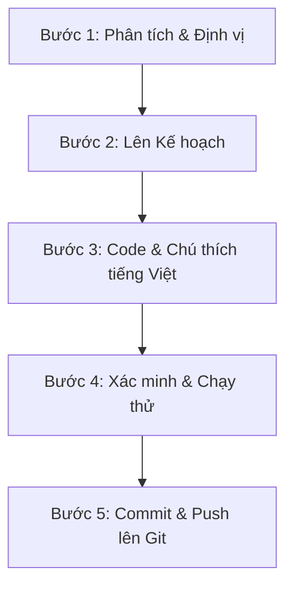

# 🔄 Quy Trình Phát Triển & Sửa Lỗi (Agent Workflow)

Quy trình này hướng dẫn chi tiết cách một Agent AI tự động hóa và xử lý các tác vụ lập trình trong dự án **PhoneGuard AIoT** một cách có hệ thống.

---

## 🔄 Chu Kỳ Lập Trình & Sửa Lỗi Chuẩn (5-Step Cycle)

Mỗi khi nhận được yêu cầu phát triển tính năng mới, chỉnh sửa giao diện hoặc sửa lỗi, Agent phải tuân thủ nghiêm ngặt chu kỳ 5 bước sau:

### 📋 Chi Tiết Từng Bước:

#### 🔍 Bước 1: Phân tích & Định vị (Analyze & Identify)
* **Hành động**: Tìm và đọc các tệp tin liên quan đến tính năng hoặc lỗi được báo cáo.
* **Mục tiêu**: Hiểu rõ ngữ cảnh của mã nguồn hiện tại, xác định nguyên nhân cốt lõi (ví dụ: cổng dịch vụ bị trùng, WebSocket bị ngắt kết nối không tự khôi phục, thuật toán AI dự báo sai...).

#### 🗺️ Bước 2: Lên Kế hoạch (Plan)
* **Hành động**: Thiết lập kế hoạch sửa đổi hoặc thêm mới mà không làm phá vỡ cấu trúc hiện tại của hệ thống.
* **Quy tắc**: Kiểm tra các tệp tin cấu hình (`requirements.txt`, `package.json`...) trước khi thêm thư viện mới để tránh xung đột phiên bản.

#### 🛠️ Bước 3: Viết Code & Chú thích tiếng Việt (Implement & Comment)
* **Hành động**: Thực hiện chỉnh sửa mã nguồn.
* **Quy định**:
  - Không viết code tắt, không sử dụng các dấu ba chấm `...` thay thế cho phần code cũ. Viết đầy đủ và chính xác.
  - **Chú thích mã nguồn**: Tất cả các đoạn comment trong file code phải được viết bằng **Tiếng Việt có dấu** rõ ràng, ghi rõ mục đích của hàm, ý nghĩa của các tham số và dòng chạy của thuật toán.
  - **Log Debug**: Thêm các câu lệnh log debug rõ ràng (Python: `print("[DEBUG] ...")` hoặc `logger.debug()`; JS: `console.log("[DEBUG] ...")`) để theo dõi luồng truyền nhận dữ liệu telemetry.

#### 🧪 Bước 4: Xác minh & Chạy thử (Verify & Test)
* **Hành động**: Chạy biên dịch và kiểm tra hoạt động của phần code vừa sửa:
  - Kiểm tra xem API FastAPI có lỗi cú pháp không (`uvicorn app.main:app` hoặc khởi động container Docker).
  - Sử dụng script `scripts/phone_simulator.py` gửi dữ liệu test để kiểm tra WebSocket và biểu đồ trên Dashboard có nhận được dữ liệu không.
* **Mục tiêu**: Đảm bảo không có lỗi biên dịch (Compile error) hoặc lỗi thời gian chạy (Runtime crash).

#### 💾 Bước 5: Commit & Đẩy Lên Git (Git Commit & Push)
* **Hành động**: Đẩy toàn bộ thay đổi lên Github.
  - Chạy `git add .` để thêm các file đã thay đổi.
  - Chạy `git commit -m "[Loại commit]: <Thông điệp commit bằng tiếng Việt mô tả đúng việc đã làm>"`
  - Chạy `git push origin main` để cập nhật trực tiếp lên repository: `https://github.com/Phuc-Bang/phoneguard-aiot.git`.
* **Quy tắc**: Không kết thúc phiên làm việc khi vẫn còn file chưa được add hoặc commit trong kho lưu trữ Git.
