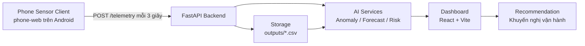

# 02. Kiến Trúc Hệ Thống

## Sơ đồ kiến trúc



## Thành phần hệ thống

| Thành phần | Vai trò | Công nghệ |
|---|---|---|
| Phone Sensor Client | Thu thập telemetry từ Android và gửi về backend | HTML, JavaScript, Battery API, DeviceMotionEvent |
| FastAPI Backend | Nhận dữ liệu, lưu CSV, gọi module AI | Python, FastAPI, Pydantic |
| Storage | Lưu telemetry, anomaly event và forecast log | CSV trong `outputs/` |
| AI Services | Phát hiện bất thường, dự báo pin, tổng hợp rủi ro | Rule-based, linear trend |
| Dashboard | Hiển thị trạng thái hệ thống | React, Vite, TypeScript, TailwindCSS, Recharts |
| Recommendation | Đưa ra khuyến nghị cho người dùng | Rule-based safety recommendation |

## Luồng dữ liệu

1. Điện thoại Android mở `phone-web/index.html`.
2. Người dùng nhập Backend URL, ví dụ `http://192.168.1.5:8000`.
3. Phone-web gửi telemetry đến `POST /telemetry` mỗi 3 giây.
4. Backend validate payload bằng Pydantic schema.
5. Backend lưu telemetry vào `outputs/phone_telemetry.csv`.
6. Module anomaly kiểm tra các rule như pin thấp, rơi, mạng offline.
7. Nếu có anomaly, backend ghi `outputs/anomaly_event_log.csv`.
8. Dashboard gọi `/latest`, `/history`, `/events`, `/forecast`, `/predict-risk`.
9. Forecast ghi kết quả vào `outputs/forecast_log.csv`.
10. Dashboard hiển thị chỉ số, biểu đồ, cảnh báo và khuyến nghị.

## Kiến trúc Docker

Docker Compose chạy 2 service:

| Service | Port | Vai trò |
|---|---:|---|
| `backend` | `8000:8000` | FastAPI backend |
| `frontend` | `3000:80` | Nginx phục vụ React/Vite build |

Backend mount volume:

```yaml
volumes:
  - ./outputs:/app/outputs
environment:
  - OUTPUT_DIR=/app/outputs
```

Nhờ volume này, dữ liệu CSV vẫn còn trên máy host dù container bị xóa.
